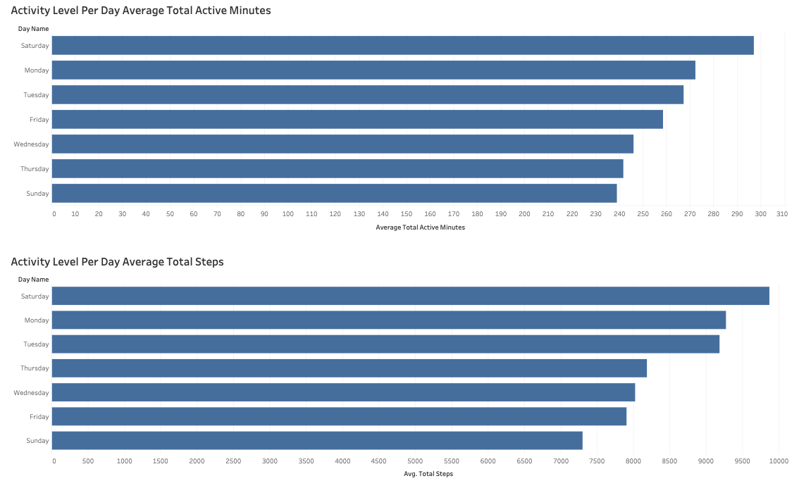

# Bellabeat Case Study

# 1: ASK

In the Ask phase, the objective is to clearly define the business problem and translate it into actionable questions. This involves understanding stakeholder goals, identifying success criteria, and outlining key deliverables while accounting for constraints such as time, resources, and data availability.

### 1.1: The Business Context

**Bellabeat Company**  
Bellabeat specializes in health-focused smart products for women. Its innovative offerings include devices such as the Leaf tracker, Time watch, Spring water bottle, and the Bellabeat app. These products deliver actionable health and wellness insights, empowering users to adopt healthier habits. Founded in 2013, Bellabeat has grown rapidly, employing both digital and traditional marketing strategies to engage its audience.

This case study will analyze usage data from Bellabeat's smart devices to uncover consumer behavior trends and generate actionable insights. The findings aim to enhance Bellabeat’s marketing strategies, expanding its footprint in the competitive global smart device market.

### 1.2: The Business Task

The goal is to analyze smart device usage data to:
- Identify trends and insights related to consumer habits.
- Provide recommendations for one of Bellabeat’s products, enabling the company to optimize its marketing strategies.
- Uncover growth opportunities and address competitive challenges in the smart device market.

### 1.3: Key Stakeholders

- Urška Sršen: Co-founder and Chief Creative Officer at Bellabeat.
- Sando Mur: Co-founder and mathematician, part of Bellabeat’s executive team.
- Bellabeat Marketing Analytics Team: Responsible for data collection, analysis, and reporting to inform Bellabeat's marketing strategies.

### 1.4: Guiding Questions

- What are the trends in smart device usage?
- How can these trends be applied to Bellabeat’s customers?
- How can these trends influence and shape Bellabeat's marketing strategy?

### 1.5: Deliverables for the Case Study

- **Business Task Summary**: A concise overview of the project goals.
- **Data Sources**: A description of all datasets used, including origins and limitations.
- **Data Cleaning and Preparation**: Documentation of preprocessing steps.
- **Analysis Summary**: Key findings and observations derived from the data.
- **Visualizations**: Charts or graphs to highlight trends and insights.
- **Recommendations**: High-level, actionable marketing strategies based on the analysis.

# 2: PREPARE

In the Prepare phase, we examine the data to assess its structure, credibility, and relevance for answering the business questions. This includes addressing potential limitations, verifying the data's integrity, and ensuring compliance with ethical and legal standards.

### 2.1: Data Source

**Primary Dataset:**
- **Name**: FitBit Fitness Tracker Data
- **Source**: Kaggle (CC0: Public Domain)
- **Description**: This dataset contains personal tracker data from 30 Fitbit users who provided consent for submission. It includes minute-level data on daily activity, daily sleep, hourly steps, hourly intensity, hourly calories, heart rate, and weight log, offering insights into users' habits. The dataset is stored in 18 separate CSV files.

### 2.2: Downloading The Data

In this case study, SQL will be the main tool for data analysis. The CSV files that will be used in this case study include:
- `dailyActivity_merged.csv`
- `sleepDay_merged.csv`
- `hourlySteps_merged.csv`
- `hourlyCalories_merged.csv`


### 2.3: Data Credibility and ROCCC Assessment

I will use ROCCC to assess whether this data has issues with bias or credibility.

- **Reliable**: No, the data is not reliable. The sample size consists of only 30 users out of over 20 million Fitbit users in 2016. Furthermore, the data was collected over just one month, which is insufficient to analyze long-term user pattern changes. Additionally, the dataset does not specify whether the 30 users were women, leaving us uncertain if the demographic aligns with Bellabeat's target consumers.
- **Original**: No, the data is not original. It was sourced through a secondary platform, Amazon Mechanical Turk.
- **Comprehensive**: No, the data is not comprehensive. Key participant details, such as age, gender, and height, are missing. Without this information, it is difficult to fully interpret the data, as these factors could significantly influence the results. Moreover, it is unclear how the 30 participants were selected—whether randomly or intentionally—which raises further questions about potential biases.
- **Current**: No, the data is not current. It was collected in 2016, which makes it eight years old and potentially outdated.
- **Cited**: Yes, the data is properly cited, with appropriate attribution to Mobius, ensuring transparency.

# 3: PROCESS
In the process phase, we ensure our data is clean by correcting or removing inaccurate, corrupted, improperly formatted, duplicate, or incomplete entries within the dataset.

### 3.1: Reviewing Our Data in SQL
- To understand our data, we will use SQL to gain an initial overview of the data types, variable names, and the volume of data available.


1. Check dailyActivity_merged.csv, sleepDay_merged.csv, hourlySteps_merged.csv, hourlyCalories_merged.csv rows and columns.
```SQL
SELECT *
FROM dailyActivity_merged

SELECT *
FROM sleepDay_merged

SELECT *
FROM hourlySteps_merged

SELECT *
FROM hourlyCalories
```
2. Check dailyActivity_merged.csv, sleepDay_merged.csv, hourlySteps_merged.csv, hourlyCalories_merged.csv data types.
```SQL
DESCRIBE dailyActivity_merged

DESCRIBE sleepDay_merged

DESCRIBE hourlySteps_merged

DESCRIBE hourlyCalories
```
3. Check dailyActivity_merged.csv, sleepDay_merged.csv, hourlySteps_merged.csv, hourlyCalories_merged.csv count of data entries.
```SQL
SELECT COUNT(*) AS total_rows FROM dailyActivity_merged;

SELECT COUNT(*) AS total_rows FROM sleepDay_merged;

SELECT COUNT(*) AS total_rows FROM hourlySteps_merged;

SELECT COUNT(*) AS total_rows FROM hourlyCalories;
```
### 3.2: Data Cleaning
1. Update the names of all four tables to make them clearer and more understandable.
```SQL
ALTER TABLE dailyActivity_merged RENAME TO daily_activity;

ALTER TABLE sleepday_merged RENAME TO sleepday;

AlTER TABLE hourlysteps_merged RENAME TO hourly_steps;

ALTER TABLE hourlycalories_merged RENAME TO hourly_calories;
```

2. Check if there are any NULL values for any of the tables.
```SQL
SELECT *
FROM daily_activity
WHERE COALESCE(Id, ActivityDate, TotalSteps, TotalDistance, TrackerDistance, LoggedActivitiesDistance, 
		VeryActiveDistance, ModeratelyActiveDistance, LightActiveDistance, SedentaryActiveDistance, 
		VeryActiveMinutes, FairlyActiveMinutes, LightlyActiveMinutes, SedentaryMinutes, Calories) IS NULL;
```
There are 0 NULL values for daily_activity because 0 rows were returned.

```SQL
SELECT *
FROM sleepday
WHERE COALESCE(Id,SleepDay,TotalSleepRecords,TotalMinutesAsleep,TotalTimeInBed) IS NULL;
```
There are 0 NULL values for sleepday because 0 rows were returned.
```SQL
SELECT *
FROM hourly_steps
WHERE COALESCE(Id,ActivityHour,StepTotal) IS NULL;
```
There are 0 NULL values for hourly_steps because 0 rows were returned.
```SQL
SELECT *
FROM hourly_calories
WHERE COALESCE(Id, ActivityHour, Calories) IS NULL;
```
There are 0 NULL values for hourly_calories because 0 rows were returned.

3. Checking for duplicates rows for any of the tables.
```SQL
SELECT Id, ActivityDate, TotalSteps
FROM daily_activity
GROUP BY Id, ActivityDate, TotalSteps
HAVING Count(*) > 1;
```
There are no duplicate rows for daily_activity because 0 rows were returned.
```SQL
SELECT ID, ActivityHour, StepTotal
FROM hourly_steps
GROUP BY ID, ActivityHour, StepTotal
HAVING COUNT(*) > 1;
```
There are no duplicate rows for hourly_steps because 0 rows were returned.
```SQL
SELECT Id, ActivityHour, Calories
FROM hourly_calories
GROUP BY Id, ActivityHour, Calories
HAVING COUNT(*) > 1;
```
There are no duplicate rows for hourly_calories because 0 rows were returned.

```SQL
SELECT Id,SleepDay,TotalSleepRecords
FROM sleepday
GROUP BY Id,SleepDay,TotalSleepRecords
HAVING COUNT(*) > 1;
```
There were 3 duplicate rows for sleepday, so we have to create a new table (cleaned_sleepday). We want to keep the original sleepday table intact. This allows us to retain the original data for reference, backup, or further analysis without risk of accidental data loss.
```SQL
CREATE TABLE cleaned_sleepday AS
SELECT DISTINCT *
FROM sleepday;
```
Our new table is called cleaned_sleepday but we will still have the original sleepday table.

4. Changing the data type of all tables from text to DATETIME enables us to join different tables more effectively and extract specific details, such as the date and time of day.
```SQL
UPDATE daily_activity SET ActivityDate = STR_TO_DATE(ActivityDate, '%c/%e/%Y');
-- Once the values are formatted correctly, update the column data type using ALTER TABLE for daily_activity
ALTER TABLE daily_activity MODIFY COLUMN ActivityDate DATETIME;

UPDATE cleaned_sleepday SET SleepDay = STR_TO_DATE(SleepDay, '%c/%e/%Y %r');
-- Once the values are formatted correctly, update the column data type using ALTER TABLE for cleaned_sleepday
ALTER TABLE cleaned_sleepday MODIFY COLUMN SleepDay DATETIME;

UPDATE hourly_steps SET ActivityHour = STR_TO_DATE(ActivityHour, '%m/%d/%Y %h:%i:%s %p');
-- Once the values are formatted correctly, update the column data type using ALTER TABLE for hourly_steps
ALTER TABLE hourly_steps MODIFY ActivityHour DATETIME;

UPDATE hourly_calories SET ActivityHour = STR_TO_DATE(ActivityHour,'%m/%d/%Y %h:%i:%s %p');
-- Once the values are formatted correctly, update the column data type using ALTER TABLE for hourly_calories
ALTER TABLE hourly_calories MODIFY ActivityHour DATETIME;
```

5. Creating new columns tailored to each specific table to enhance our data analysis.

5.1: Daily Activity

5.1.1: Create new columns TotalActiveMinutes and TotalActiveDistance
```SQL
ALTER TABLE daily_activity ADD COLUMN TotalActiveMinutes INT;
UPDATE daily_activity SET TotalActiveMinutes = VeryActiveMinutes + FairlyActiveMinutes + LightlyActiveMinutes;

ALTER TABLE daily_activity ADD COLUMN TotalActiveMinutes INT;
UPDATE daily_activity SET TotalActiveMinutes = VeryActiveMinutes + FairlyActiveMinutes + LightlyActiveMinutes;
```
5.1.2: Getting the day of the week name and adding it as a new column
```SQL
ALTER TABLE daily_activity ADD COLUMN DayName VARCHAR(9);
UPDATE daily_activity SET DayName = DAYNAME(ActivityDate);
```
5.1.3: Separate ID by Light, Moderate, and Very Active by the amount of daily activity
```SQL
SELECT
	ID,
	COUNT(*) as TotalLoggedDays,
    CASE
		WHEN COUNT(Id) BETWEEN 0 AND 14 THEN 'Light User'
        WHEN COUNT(Id) BETWEEN 15 AND 24 THEN 'Moderate User'
        WHEN COUNT(Id) BETWEEN 25 AND 31 THEN 'Very Active User'
	END AS fitbitactivity
FROM daily_activity
GROUP BY Id;
```
5.1.4: Add a new column, fitbitactivity, to categorize users based on the frequency of their activity logs.
```SQL
ALTER TABLE daily_activity ADD COLUMN fitbitactivity VARCHAR(20);
UPDATE daily_activity 
  JOIN (
    SELECT 
      Id, 
      CASE 
      WHEN COUNT(*) BETWEEN 0 AND 14 THEN 'Light User' 
      WHEN COUNT(*) BETWEEN 15 AND 24 THEN 'Moderate User' 
      WHEN COUNT(*) BETWEEN 25 AND 31 THEN 'Very Active User' END AS fitbitactivity 
    FROM 
      daily_activity 
    GROUP BY 
      Id
  ) AS summary ON daily_activity.Id = summary.Id 
SET 
  daily_activity.fitbitactivity = summary.fitbitactivity;
```

5.2: Sleep Day

5.2.1: Addding new column MinutesAwakeInBed = TotalTimeInBed - TotalMinutesAsleep
```SQL
ALTER TABLE sleepday ADD COLUMN MinutesAwakeInBed INT;
UPDATE sleepday SET MinutesAwakeInBed = TotalTimeInBed - TotalMinutesAsleep;
```

5.2.2: Getting the day of the week name and then adding it to a new column
```SQL
SELECT DAYNAME(SleepDay) AS DAYNAME
FROM cleaned_sleepday;
ALTER TABLE cleaned_sleepday ADD COLUMN DayName VARCHAR(9);
UPDATE cleaned_sleepday SET DayName = DAYNAME(SleepDay);
```

5.2.3: Changing Columns To Hours From Minutes. Changing Data Type FROM INT to FLOAT before updating the columns to be in hours instead of minutes
```SQL
-- 1. Changing Columns To Hours From Minutes
SELECT TotalMinutesAsleep/60 AS TotalHourAsleep,
TotalTimeInBed/60 AS TotalHourInBed,
MinutesAwakeInBed/60 AS HoursAwakeInBed
FROM cleaned_sleepday;

-- 2. Changing Data Type FROM INT to FLOAT before updating the columns to be in hours instead of minutes
ALTER TABLE cleaned_sleepday
MODIFY TotalMinutesAsleep FLOAT,
MODIFY TotalTimeInBed FLOAT,
MODIFY MinutesAwakeInBed FLOAT;

-- 3. Changing Column Names TO Hours Now
ALTER TABLE cleaned_sleepday RENAME COLUMN TotalMinutesAsleep TO TotalHourAsleep;
ALTER TABLE cleaned_sleepday RENAME COLUMN TotalTimeInBed TO TotalHourInBed;
ALTER TABLE cleaned_sleepday RENAME COLUMN MinutesAwakeInBed TO HoursAwakeInBed; 
```

5.3: Hourly Steps

5.3.1: Getting the day of the week name and saving it as a column
```SQL
SELECT DAYNAME(ActivityHour) AS DAYNAME
FROM hourly_steps;
ALTER TABLE hourly_steps ADD COLUMN DayName VARCHAR(9);
UPDATE hourly_steps SET DayName = DAYNAME(ActivityHour);
```

5.4: Hourly Calories

5.4.1: Getting the day of the week name and saving it as a column
```SQL
ALTER TABLE hourly_calories ADD COLUMN DayName VARCHAR(9);
UPDATE hourly_calories SET DayName = DAYNAME(ActivityHour);
```

### 3.3: Data Cleaning Joining Tables

3.3.1: LEFT JOIN daily_activity AND cleaned_sleepday on ID and Activity Date
```SQL
SELECT *
FROM daily_activity
LEFT JOIN cleaned_sleepday ON daily_activity.Id = cleaned_sleepday.Id
	AND daily_activity.ActivityDate = cleaned_sleepday.SleepDay;
```

3.3.2: LEFT JOIN daily_activity and Sleepday, grouping by Activity Date and ID. Getting the AVG of the different columns 
```SQL
SELECT ActivityDate, COUNT(*), AVG(TotalSteps), AVG(TotalDistance), AVG(Calories), AVG(TotalActiveMinutes), 
AVG(TotalActiveDistance), AVG(TotalSleepRecords), AVG(TotalHourAsleep), AVG(HoursAwakeInBed), AVG(HoursAwakeInBed)
FROM cleaned_sleepday
LEFT JOIN daily_activity ON daily_activity.Id = cleaned_sleepday.Id AND daily_activity.ActivityDate = cleaned_sleepday.SleepDay
GROUP BY ActivityDate
ORDER BY AVG(TotalSteps) DESC;
```

# 4: ANALYZE
In this step, we calculate key metrics, analyze patterns, and summarize data to provide insights that address our business objectives.

This SQL query analyzes user activity data grouped by unique user IDs (Id). For each user, it calculates the total number of activity entries (Total_Entries) and summarizes their daily activity metrics. It computes the average daily distance traveled (AVG_Distance) and the standard deviation of the distances (StdDev_Distance), highlighting both typical activity levels and variations in performance. Similarly, it calculates the average number of steps taken daily (AVG_Steps) and their variability (StdDev_Steps), as well as the average minutes spent in active movement per day (AVG_Active_Minutes) and the variability in those active minutes (StdDev_Active_Minutes). This query helps to identify patterns in users’ physical activity, such as consistency, overall activity levels, and potential outliers or irregular behaviors.
```SQL
SELECT 
    Id, 
    COUNT(*) AS Total_Entries, 
    AVG(TotalDistance) AS AVG_Distance, 
    STDDEV(TotalDistance) AS StdDev_Distance, 
    AVG(TotalSteps) AS AVG_Steps, 
    STDDEV(TotalSteps) AS StdDev_Steps, 
    AVG(TotalActiveMinutes) AS AVG_Active_Minutes, 
    STDDEV(TotalActiveMinutes) AS StdDev_Active_Minutes
FROM 
    daily_activity
GROUP BY 
    Id;
```
-- There is a clear diversity in activity levels among users, from sedentary to highly active individuals.
High standard deviations in some cases indicate irregularity, while low standard deviations suggest consistent habits.
Users with similar Avg_Distance and Avg_Steps often display similar Avg_ActiveMinutes, implying these metrics are interrelated.

The data shows that, on average, Saturday is the most popular day for exercise, followed by Tuesday, based on the average number of steps taken.
```SQL
SELECT DayName, 
       COUNT(*) AS Total_Entries,
       SUM(TotalDistance) AS Total_Distance,
       AVG(TotalDistance) AS Avg_Distance,
       SUM(TotalSteps) AS Total_Steps,
       AVG(TotalSteps) AS Avg_Steps,
       SUM(TotalActiveMinutes) AS Total_ActiveMinutes,
       AVG(TotalActiveMinutes) AS Avg_ActiveMinutes
FROM daily_activity
GROUP BY DayName
ORDER BY Avg_Steps DESC;
```

Earlier, we created a column called "fitbitactivity," which classifies user entries based on the frequency of their activity logs. Users are classified as "Light Users" if their total entries are between 0 and 14, "Moderate Users" if their total entries are between 15 and 24, and "Very Active Users" if their total entries are between 25 and 31. By grouping the data by "Day Name" and "fitbitactivity," we can obtain a more accurate view of the average steps taken by users on different days. 
```SQL
SELECT DayName, fitbitactivity,
       COUNT(*) AS Total_Entries,
       SUM(TotalDistance) AS Total_Distance,
       AVG(TotalDistance) AS Avg_Distance,
       SUM(TotalSteps) AS Total_Steps,
       AVG(TotalSteps) AS Avg_Steps,
       SUM(TotalActiveMinutes) AS Total_ActiveMinutes,
       AVG(TotalActiveMinutes) AS Avg_ActiveMinutes
FROM daily_activity
GROUP BY DayName, fitbitactivity
ORDER BY fitbitactivity, Avg_Steps DESC;
```
Analysis: For "Light Users," we observe only four entries in total across separate days, making it not significant enough to analyze further. For "Moderate Users," the days with the highest average steps are Saturday, followed by Wednesday. For "Very Active Users," the days with the highest average steps are Tuesday, followed by Saturday.


The data shows the average calories burned and activity minutes (Very Active, Fairly Active, Lightly Active, and Total Active Minutes) grouped by user activity level (Light, Moderate, Very Active) and day of the week. It highlights that Light Users primarily rely on Lightly Active Minutes, resulting in the lowest calorie burn, while Moderate Users achieve a balance across all activity types, leading to moderate calorie burn. Very Active Users consistently burn the most calories due to higher Very Active Minutes, which strongly correlate with calorie burn. Interestingly, for Very Active Users, Friday shows higher calorie burn than Saturday, despite Saturday having slightly higher averages in all activity categories, suggesting differences in activity intensity or outliers affecting the totals. Overall, the data underscores that activity intensity, especially Very Active Minutes, is the key driver of calorie expenditure.
```SQL
SELECT 
    fitbitactivity, 
    DayName, 
    ROUND(AVG(COALESCE(Calories, 0)), 2) AS avg_calories, 
    AVG(COALESCE(VeryActiveMinutes, 0)) AS avg_very_active_minutes, 
    AVG(COALESCE(FairlyActiveMinutes, 0)) AS avg_fairly_active_minutes, 
    AVG(COALESCE(LightlyActiveMinutes, 0)) AS avg_lightly_active_minutes,
    AVG(COALESCE(TotalActiveMinutes, 0)) AS avg_total_active_minutes
FROM daily_activity
GROUP BY fitbitactivity, DayName
ORDER BY fitbitactivity, avg_calories DESC;
```

The data reveals that the average sedentary minutes are not correlated with the average total active minutes. When we calculate the ratio of average sedentary minutes to average total active minutes, the result shows that a higher active-to-sedentary ratio indicates that, on average, individuals are spending a greater proportion of their time being active rather than sedentary. Saturday has the highest active-to-sedentary ratio, followed by Friday.
```SQL
SELECT 
    DayName, 
    ROUND(AVG(COALESCE(SedentaryMinutes, 0)), 2) AS avg_sedentary_minutes, 
    ROUND(AVG(COALESCE(TotalActiveMinutes, 0)), 2) AS avg_total_active_minutes,
    COUNT(*) AS total_records,
    ROUND(AVG(COALESCE(TotalActiveMinutes, 0)) / AVG(COALESCE(SedentaryMinutes, 0)), 3) AS active_to_sedentary_ratio
FROM 
    daily_activity
GROUP BY 
    DayName
ORDER BY 
    active_to_sedentary_ratio DESC;
```


The data shows the total number of steps taken, grouped by the hour of the day. It reveals that 18:00 (6:00 PM) and 19:00 (7:00 PM) are the hours with the highest total step counts. These same hours also have the highest average step counts.
```SQL
SELECT 
    HOUR(ActivityHour) AS HourOfDay, 
    COUNT(*) AS TotalRecords, 
    SUM(StepTotal) AS TotalSteps,
    AVG(StepTotal) AS AVGSteps
FROM 
    hourly_steps
GROUP BY 
    HOUR(ActivityHour)
ORDER BY 
    TotalSteps DESC;
```

The data indicates that, on average, 18:00 (6 PM) is the time when users burn the most calories, followed by 17:00 (5 PM) and 19:00 (7 PM). Therefore, the period between 5 PM and 7 PM is when users typically experience the highest calorie expenditure.
```SQL
SELECT 
    HOUR(ActivityHour) AS HourOfDay, 
    ROUND(AVG(COALESCE(Calories, 0)), 2) AS AvgCalories
FROM 
    hourly_calories
GROUP BY 
    HOUR(ActivityHour)
ORDER BY 
    AvgCalories DESC;
```

The data indicates that, on average, Saturday is when the most calories are burned, followed by Tuesday, Friday, Monday, Thursday, Wednesday, and Sunday.
```SQL
SELECT 
    DAYNAME(ActivityHour) AS DayOfWeek, 
    ROUND(AVG(Calories), 2) AS AvgCalories
FROM 
    hourly_calories
GROUP BY 
    DayOfWeek
ORDER BY 
    AvgCalories DESC;
```

# 5: SHARE
The Share phase of data analytics involves communicating our findings and insights effectively to stakeholders or decision-makers. This phase is critical because the value of our analysis depends on how well others understand and act on it.

### Active to Sedentary Ratio by Day of the Week

This graph displays the Active to Sedentary Ratio by Day of the Week, illustrating how active individuals are relative to their sedentary time on different days. The ratio is calculated by dividing total active minutes by total sedentary minutes. A higher active-to-sedentary ratio indicates greater physical activity levels. This metric provides a standardized way to compare activity levels across different days, making it easier to identify trends and patterns. From the graph, we can see that Saturday and Friday have the highest ratios, suggesting that people tend to be more active on these days.

### Dashboard of Activity Level Per Day 

Looking at the average activity level per day, Saturday stands out as the most active day, as shown by the highest average total active minutes. Additionally, the data indicates a positive correlation between active minutes and average total steps—more active minutes generally correspond to a higher step count.

### Activity Patterns by Day of the Week and Activity Level 

This graph illustrates the average total steps taken by users categorized as 'Moderate' and 'Very Active.' It reveals that Tuesday is the most popular day for exercise among 'Very Active' users, followed closely by Saturday, based on average total steps. Meanwhile, for 'Moderate' users, Saturday and Wednesday are the most popular days for exercise.

### Average Calories Dashboard by Day and Hour 

The graph illustrates that Saturday has the highest average calorie burn based on overall trends. Additionally, the data shows that calorie expenditure peaks between 5:00 PM and 7:00 PM, with the highest point at 6:00 PM. Conversely, the lowest calorie burn occurs between 11:00 PM and 5:00 AM.

### Average Step Total Dashboard

The graph shows that Saturday has the highest average step count, while Sunday has the lowest. The highest average step count occurs between 12:00 PM – 2:00 PM and 5:00 PM – 7:00 PM, with the peak at 6:00 PM.

### User Classification by Activity Level

The user activity levels are illustrated in this graph, with 93.51% of users categorized as 'Very Active Users,' 6.06% as 'Moderate Users,' and 0.43% as 'Light Users.'

### Average Total Steps, Calories, and Active Minutes Per Day

The graph shows that average steps, calories, and total active minutes are all correlated; as one increases or decreases, the others follow suit.


# 6: ACT
Based on the data analysis in the Bellabeat case study, several actionable solutions can be shared with stakeholders to optimize Bellabeat’s marketing strategy and improve consumer engagement:

### 1. Target Active Days for Promotions
Analysis shows that Saturdays and Fridays have the highest active-to-sedentary ratios, with Saturday being the most active day overall.

Recommendation: Bellabeat could leverage these days for targeted promotions or campaigns to encourage user engagement. For example, launching a "Weekend Challenge" that rewards users for reaching fitness goals on Fridays and Saturdays could increase device usage and overall participation.

### 2. Encourage Consistency in Activity
There is significant variability in users' daily activity levels, with some displaying inconsistent habits (high standard deviations in daily steps and active minutes).

Recommendation: Bellabeat could introduce personalized fitness plans or reminders to promote consistent activity. Offering daily or weekly goals and sending automated reminders may help moderate users increase their activity frequency. For very active users, challenges to maintain or improve performance could further enhance engagement.

### 3. Focus on Evening Activity Engagement
Users are most active in the late afternoon and evening, particularly around 6 PM and 7 PM, when they take the most steps and burn the most calories.

Recommendation: Bellabeat can implement targeted notifications or gamification strategies to engage users during these peak times. Time-sensitive challenges or real-time progress tracking toward evening fitness goals can encourage sustained activity and device interaction.

### 4. Leverage Day-Specific Insights for Custom Recommendations
Analysis indicates that Saturdays and Tuesdays have the highest average steps and calories burned.

Recommendation: Bellabeat could push personalized recommendations and reminders on these days, encouraging users to meet specific fitness goals. Additionally, day-specific campaigns or promotions offering incentives for increased activity on Saturdays and Tuesdays could drive further engagement.

### 5. Encourage Social Engagement Through Activity Levels
Social features can significantly enhance user engagement. Activity pattern analysis reveals diverse fitness levels among users.

Recommendation: Bellabeat could introduce social challenges based on activity levels, allowing users to connect with others who share similar fitness habits. For instance:
- Light Users could participate in gentle challenges to gradually increase activity.
- Very Active Users could engage in competitive, high-intensity challenges.
- This social component would enhance motivation and foster a sense of community.

### 6. Personalized Recommendations for Calorie and Activity Tracking
Calorie expenditure is strongly influenced by activity intensity, particularly for very active users.

Recommendation: Bellabeat should personalize calorie tracking based on individual activity levels and goals. For example:
- Very Active Users could receive detailed insights into calorie burn based on workout intensity.
- Light Users could get gradual improvement suggestions to increase calorie expenditure effectively.
This tailored approach would enhance user experience and motivation while promoting healthier habits.

